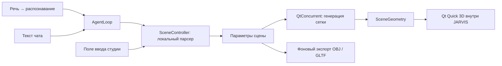

# Встроенная 3D-студия JARVIS

## Живое рисование

Добавлены текстовые подписи и пошаговые схемы. Команда «объясни как работает видеокарта» локально показывает четыре подписанных блока со стрелками; вслух произносится короткое подтверждение. Для других объяснений DeepSeek получает инструкцию создавать 3–6 этапов, краткие подписи и стрелки вместо длинного ответа. Поле `labels` содержит `text`, `x`, `y`, `at` (момент появления от 0 до 1); поддерживается и текст без линий. Текст выводится как текст, без HTML. Лимит — 40 подписей по 160 символов. Схема видеокарты проверена снимком работающего приложения; поведение свободных объяснений через реальный API не проверялось.

Команды «нарисуй дом», «нарисуй джойстик», «нарисуй линии синуса» открывают чёрный холст с последовательной прорисовкой светящихся линий. Эти простые запросы выполняются локально. «Нарисуй y = sin(x)*2» строит кривую из формулы.

Для свободных описаний добавлен инструмент DeepSeek `draw_live`. Он принимает проверяемый JSON с названием и полилиниями, включая необязательную третью координату. Модель должна сама составить контуры и детали под запрос. Никакой код из ответа не исполняется. Лимиты: 200 линий, 5000 точек, координаты от -1000 до 1000. В режиме рисования нет скачивания: результат предназначен для просмотра внутри приложения.

Рисунок появляется после получения полного описания от API, затем линии прорисовываются за 2–10 секунд. Это анимация построения, а не отображение незавершённых токенов модели. Для свободных запросов нужны подключение к DeepSeek и интернет; качество произвольных рисунков зависит от модели. Локальные примеры и проверка формата протестированы, платный запрос к DeepSeek в ходе проверки не выполнялся.

Колесо меняет масштаб, ЛКМ перемещает рисунок, ПКМ поворачивает координаты в пространстве; у плоских рисунков глубина нулевая. «Заново» повторяет прорисовку. При сворачивании окна анимация приостанавливается.

## Реализация и выбор технологии

Используется Qt Quick 3D: интерфейс приложения уже написан на C++ и Qt Quick. Геометрия загружается прямо в View3D, без браузера, WebView2 и отдельного процесса. Библиотеки поставляются рядом с EXE. Интернет и DeepSeek для перечисленных ниже команд не нужны.



## Команды

- «Покажи куб», «покажи дом», «сделай модель кружки».
- «Добавь сферу», «покажи цилиндр», «покажи тор».
- «Покажи красный металлический куб шириной 2 высотой 1».
- «Покажи график z = sin(x) * cos(y)».
- «Вращай модель», «останови модель», «включи пульсацию модели».
- «Покрась модель в красный», «сделай модель стеклянной».
- «Увеличь модель», «сбрось камеру сцены», «очисти сцену».
- «Открой модель на весь экран», «экспорт модели obj».

«Покажи» заменяет сцену, «добавь» сохраняет существующие модели. Лимит — 8 моделей и расчётный бюджет 1 миллиона треугольников. Неизвестный объект вызывает подсказку, а не запуск произвольного кода.

## Управление

Открыть студию можно через верхнее меню или командой создания модели. ЛКМ вращает камеру, Ctrl + ЛКМ перемещает, колесо меняет масштаб. Выбор модели — щелчок или список справа. Панель позволяет менять размеры, цвет, материал, процедурную окраску, детализацию и свет. Доступны сброс камеры, полноэкранный режим, вращение и пульсация. Анимация при скрытом окне останавливается.

Экспорт сохраняется в системную папку «Документы» → JARVIS → 3D. GLTF содержит встроенный буфер, сетки и материалы; OBJ — сетки и нормали с расширением цвета вершин. Это статический экспорт: движение камеры и анимация не сохраняются. Поддержка цвета OBJ зависит от импортирующей программы.

## Интеграция

1. CMake подключает Qt Quick3D и Concurrent и библиотеку `src/scene3d`.
2. `main.cpp` регистрирует Scene3D и SceneGeometry и оборачивает существующий localCommand, сохраняя обработчик памяти.
3. `SceneController` разбирает команды до обращения к языковой модели.
4. `Mesh.cpp` строит примитивы, дом с крышей/окнами/дверью, полую кружку с ручкой и сетки функций.
5. `SceneGeometry` строит геометрию в фоне; при изменении параметров применяет только актуальный результат.
6. `ui/pages/ScenePage.qml` отображает сцену. Новая страница подключена в меню.

Минимальный пример используемого нативного вьювера:

```qml
import QtQuick3D
import Jarvis.Scene3D
View3D {
    PerspectiveCamera { id: camera; z: 600 }
    camera: camera
    DirectionalLight { eulerRotation.x: -30 }
    Model {
        scale: Qt.vector3d(100, 100, 100)
        geometry: SceneGeometry { spec: ({kind: "cube"}) }
        materials: PrincipledMaterial { baseColor: "#408cff" }
    }
}
```

Пример на Three.js/WebView2 заменён рабочим примером Qt Quick 3D: второй движок в приложение не добавлялся.

## Проверки и ограничения

`tst_scene3d` проверяет приоритет математических операций, отклонение постороннего кода, корректность индексов и конечность координат всех семи типов моделей, команды, бюджет сцены, OBJ и встроенный буфер GLTF. Сборка: `scripts/build.bat release`. Тест: `ctest --test-dir build/msvc-release -R tst_scene3d --output-on-failure`.

Для проверки настоящего окна предусмотрен `--smoke-test` с переменными `JARVIS_DATA_ROOT` (отдельные данные), `JARVIS_SMOKE_OUTPUT` (папка снимка) и `JARVIS_3D_SMOKE_COMMAND` (например, «покажи дом»). Команда проходит через AgentLoop; снимок создаётся через 1,6 секунды после отправки команды.

Ручные сценарии: создать куб; повернуть/приблизить/переместить камеру; создать дом; добавить кружку; поменять материал; построить поверхность; экспортировать и открыть результат в другом 3D-редакторе; скрыть окно и проверить прекращение анимации.

Проверено 10 сентября 2026: Release-сборка успешна, все 6 проверок QtTest прошли. Сетка поверхности из 980 000 треугольников построена за 1036 мс на i9-11900K. В настоящем окне приложения проверены куб, дом, кружка и поверхность; снимки находятся в `build/scene3d-smoke`. Для куба, кружки и поверхности команда прошла через общий AgentLoop, результат присутствовал на снимке через 1,6 секунды. Это проверка времени после команды, без учёта запуска программы и распознавания речи. Замер FPS, ручное управление камерой и импорт экспорта сторонним редактором в этой проверке не выполнялись.

Формулы ограничены 256 символами и поддерживают x, y, pi, e, арифметику, sin/cos/tan/sqrt/abs/exp/log. Область поверхности — [-3,3] по обеим переменным. Некорректные и неограниченные точки отбрасываются. Произвольные текстуры, импорт FBX/OBJ/GLTF и свободное построение любых объектов по описанию пока отсутствуют. Стекло — прозрачный материал без физического преломления. Гарантия плавности миллиона полигонов на любом среднем ПК не заявляется: нужен отдельный замер FPS на целевой конфигурации.
